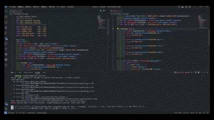
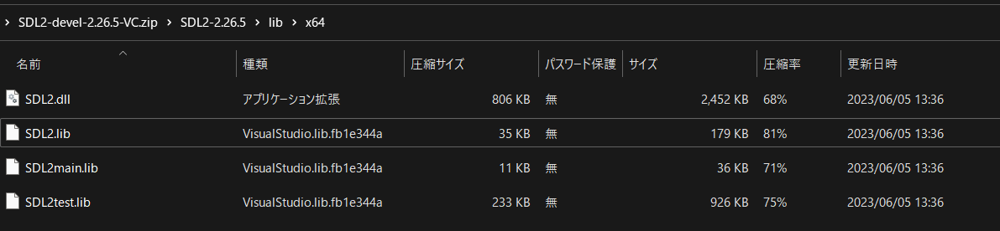

# はじめに
この`リポジトリ`は、私が`Rustの初心者の時に作成したコード`です。  
これからRustを学ぶ方の学習の助けになれば幸いです。  
※ 技術的ご質問にはお答えできません。

[SDL2 Sample Code!!!]  

# フィルダ構成
| ファイル、フィルダ | 説明       |
| ---------- | ---------- |
| `hello_world`  | "Hello, Rust!"と表示される      |
| `data_type`  | Rustのデータ型について      |
| `if_match`  | 条件分岐。if,matchを使用      |
| `loop_for_while`  |  繰り返し。loop,for,whileを使用      |
| `def_func`  | メソッド（関数）の宣言      |
| `rust_vec`  |  可変長さ配列の`Vec`の使い方      |
| `rust_generic`  |  `<T>`のジェネリック型      |
| `rust_vec_generic`  | `Vec`の使い方とジェネリック型      |
| `rust_opp`  | Rustでのオブジェクト指向      |
| `thread`  | Rustでのスレッド      |
| `thread_channel`  | 非同期でのスレッド間のデータ送受信      |
| `thread_sync`  | 非同期でのスレッド間のデータ送受信      |
| `file_io`  | `cargo run the doc/test.txt`でテキストを表示      |
| `rust_sdl2`  | SDL2による描画＆キーボード操作      |

# SDL2のインストール（Windows11 x64）
## 1.ダウンロード
下記URLのgithubから`SDL2-devel-2.x.x-VC.zip`をダウンロード  
https://github.com/libsdl-org/SDL/releases

## 2.インストール
解凍したファルダの`lib/x64` 内のファイルをすべて下記にコピー＆ペースト  

  
[Windows11 x64の場合]  
>C:/Users/`{USER_NAME}`/.rustup/toolchains/stable-x86_64-pc-windows-msvc/lib/rustlib/1stable-x86_64-pc-windows-msvc/lib
  
※ `{USER_NAME}` ... PCのユーザネーム

## 3.実行
 1) `cargo run` で実行
 2) キーボードの十字キーに応じて画面内のオブジェクトが動く
